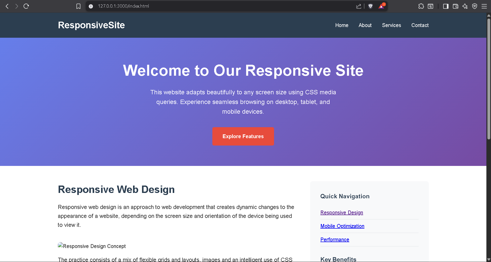

# 📱 Responsive Website with CSS Media Queries

A fully responsive website built using **HTML**, **CSS**, and **JavaScript**, demonstrating mobile-first design with CSS media queries.  
The site adapts seamlessly to **desktop, tablet, and mobile devices** with an interactive hamburger menu for small screens.

---

## 📸 Demo Screenshot

  

---

## 🚀 Features

- **Mobile-Friendly Design** – Adjusts layout for all screen sizes.
- **Hamburger Menu** – Smoothly toggles navigation links on mobile.
- **Hero Section** – Eye-catching header with a call-to-action button.
- **Responsive Images** – Automatically scale to fit screen width.
- **Sidebar** – Quick navigation and key benefits list.
- **Feature Cards** – Grid-based layout that adapts for smaller devices.
- **Sticky Header** – Always visible navigation bar.

---

## 🛠️ Technologies Used

- **HTML5** – Structure and semantic elements.
- **CSS3** – Flexbox, Grid, and Media Queries for responsiveness.
- **JavaScript (ES6)** – Mobile menu toggle functionality.

---

## 📂 Project Structure

```
├── index.html       # Main HTML file
├── style.css        # CSS styles (with media queries)
├── script.js        # JavaScript for mobile menu
└── screenshot.png   # Demo screenshot
```

---

## 📏 Media Query Breakpoints

- **Desktop** – Default styles for large screens.
- **Tablet** – `@media (max-width: 1024px)`
- **Mobile** – `@media (max-width: 768px)`
- **Small Mobile** – `@media (max-width: 480px)`

---

## 📥 Setup & Usage

1. **Clone this repository**
   ```bash
   git clone https://github.com/shubham010-dev/task_04.git
   ```

2. **Navigate to the project folder**
   ```bash
   cd your-repo-name
   ```

3. **Open in browser**
   - Double-click `index.html`  
   *or*
   - Serve with a local server (optional):
     ```bash
     python -m http.server
     ```

---

## 📌 How It Works

- **Responsive Layout**:  
  The website uses **CSS Grid and Flexbox** for layout and adapts to screen size using **media queries**.

- **Mobile Menu**:  
  A JavaScript function toggles the `.active` class on the navigation to show/hide links when the hamburger icon is clicked.

---

## 🔮 Future Improvements

- Smooth slide-down animation for the mobile menu.
- Dark/Light theme toggle.
- Lazy-loading for images.